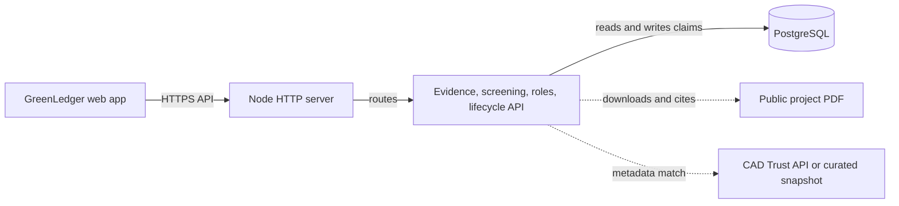

# GreenLedger architecture

## Request flow

1. A role-authenticated user submits either a configured demo record or an HTTPS public-PDF URL.
2. The evidence service downloads PDFs with a timeout and size cap, calculates a SHA-256 hash of the bytes, extracts text, and attaches page-level excerpts to recognised fields.
3. Validation rejects evidence if required identity fields lack page citations.
4. The screening service creates a canonical key from registry, project ID, and serial range; it checks PostgreSQL for exact keys, then calls the CAD Trust adapter for project metadata overlaps.
5. A verifier can persist only eligible records. A beneficiary can retire only active verified records. Both operations are stored in PostgreSQL with `onchain_status = not-configured` until the contract integration is added.

## Security boundaries

- The API uses signed bearer tokens and enforces the `developer`, `verifier`, and `beneficiary` roles server-side.
- Public PDF URLs must use HTTPS. `PDF_ALLOWED_HOSTS` optionally makes the source list explicit for deployments.
- Passwords, token secrets, database strings, and CAD Trust credentials are environment variables only.
- The public certificate should be a separate read-only endpoint when it is exposed outside the authenticated workspace.
